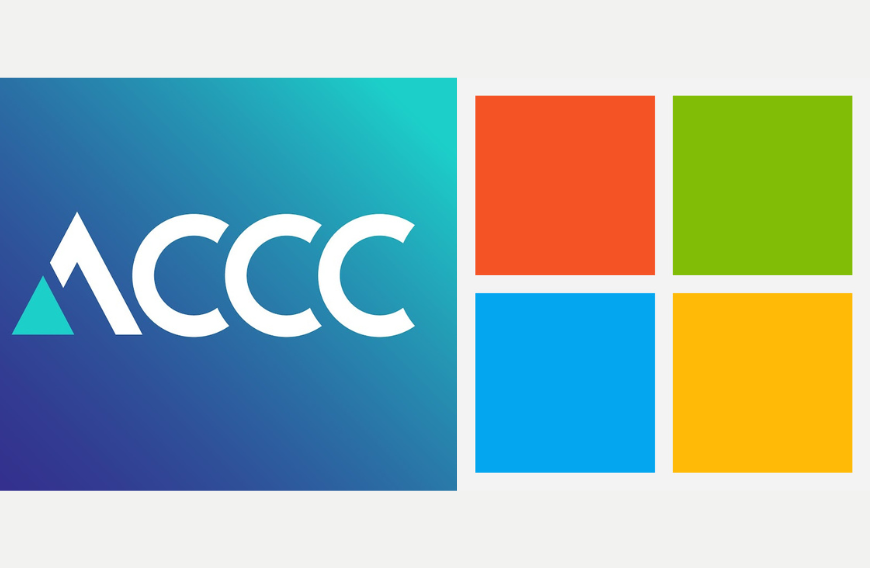

+++
title = ' Australia kiện Microsoft vì cáo buộc 'lừa' 2,7 triệu người dùng nâng cấp Microsoft 365'
date = '2025-10-28T16:14:16+07:00'
draft = false
tags = []
categories = []
+++

Ủy ban Cạnh tranh và Tiêu dùng Úc (ACCC) đã kiện Microsoft với cáo buộc lừa hàng triệu người dùng (thống kê của ACCC từ tháng 10, 2024 là 2,7 triệu) bằng cách khiến người dùng hiểu lầm, từ đó nâng cấp lên các gói Microsoft 365 giá đắt hơn với Copilot tích hợp.

Trong đơn kiện, ACCC cho rằng Microsoft đã không thông báo rõ ràng cho người biết về việc gói Microsoft 365 cũ không có Copilot vẫn còn đó, vẫn đăng ký được chỉ là không đơn giản để làm điều này. Khi người dùng hủy đăng ký gói đang dùng, trong tiến trình hủy đăng ký này thì tùy chọn trở về gói “Cổ điển” (Classic) mới xuất hiện và thiết kế kiểu "đánh lận con đen" này đã vi phạm luật tiêu dùng của Úc do không công bố thông tin cần thiết và tạo ra ấn tượng sai lầm về các lựa chọn có sẵn đối với sản phẩm. Từ khi tích hợp Copilot, giá của thuê bao Microsoft 365 Personal đã tăng 45% còn Family là 29%.
*Trên trang hỗ trợ, Microsoft cũng hướng dẫn cách hạ cấp về gói Classic nhưng thực sự phải đến khi biết đến vụ việc, mình mới biết là gói cũ vẫn còn. Microsoft không hề cung cấp tùy chọn gói có và không có Copilot khi đăng ký.

Ngoài ra, ACCC còn nhấn mạnh rằng các biện pháp truyền thông qua email và bài blog trước đó cũng không đề cập đến lựa chọn rẻ hơn, tức là gói Classic, chỉ báo cho người dùng về việc tăng giá và giá mới tự động được áp dụng trong lần gia hạn tiếp theo.

ACCC đang muốn Microsoft phải chịu các hình phạt, bồi thường cho người tiêu dùng, thậm chí là lệnh huấn thị và các phí tổn từ chi nhánh Microsoft Úc cũng như công ty mẹ ở Mỹ. Mức phạt tối đa có thể áp dụng đối với mỗi hành vi vi phạm luật tiêu dùng Úc là hơn 50 triệu AUD, gấp 3 lần lợi ích thu được có thể quy kết hợp lý hoặc 30% doanh thu đã điều chỉnh của công ty trong thời gian vi phạm nếu không thể xác định được giá trị của lợi ích.

ACCC cho biết mọi hình phạt sẽ do Tòa án quyết định và sẽ phụ thuộc vào kết luận của Tòa. Một đại diện của Microsoft cho biết đang xem xét các cáo buộc của ACCC.