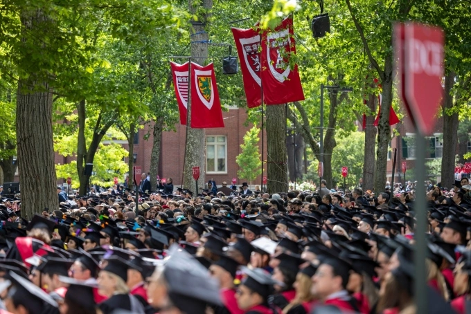

+++
title = 'Bây giờ nhay cả sinh viên Harvard cũng khó tìm việc, các vấn đề của hệ thống tuyển dụng hiện tại ở Hoa Kỳ.'
date = '2025-10-29T11:59:41+07:00'
draft = false
tags = []
categories = []
+++

Một cử nhân tốt nghiệp Harvard – ngôi trường danh giá bậc nhất thế giới – đã thất nghiệp hơn một năm dù sở hữu nhiều bằng cấp và kinh nghiệm. Câu chuyện của cô không phải cá biệt: 23% sinh viên Harvard không có việc làm sau ba tháng tốt nghiệp, con số cao nhất trong lịch sử.

Thừa lao động và thiếu cơ hội việc làm là có thật.

Nhiều người nghĩ nguyên nhân do doanh nghiệp ngừng tuyển dụng hoặc do AI thay thế lao động. Thực tế thì ngược lại: số lượng việc làm đăng tuyển ngày càng tăng, nhưng nguồn cung nhân lực có trình độ lại quá lớn.
Bằng đại học – từng là “tấm vé vàng” vào sự nghiệp ổn định – giờ chỉ còn là yêu cầu tối thiểu. Nhiều vị trí đầu vào (entry-level) đòi hỏi cả kinh nghiệm thực tế, danh mục dự án, và thời gian thực tập không lương, khiến sinh viên mới ra trường rơi vào vòng luẩn quẩn: “Cần kinh nghiệm để có việc – cần việc để có kinh nghiệm.”

Công nghệ dùng trong tuyển dụng làm mất đi “yếu tố con người” 

Ngày nay, khi một công ty đăng tin tuyển dụng, hàng nghìn người nộp hồ sơ chỉ trong vài phút. Để xử lý, doanh nghiệp sử dụng phần mềm lọc hồ sơ tự động (ATS) – hệ thống đánh giá CV bằng từ khóa thay vì năng lực thật.
Nếu hồ sơ không khớp hoàn toàn với mô tả công việc, ứng viên sẽ bị loại trước khi con người kịp xem xét.

Nghiêm trọng hơn, nhiều tin tuyển dụng còn là “việc ảo” (ghost jobs) – đăng chỉ để tạo hình ảnh công ty đang mở rộng, hoặc để thu thập dữ liệu ứng viên. Theo thống kê, gần 50% tin tuyển dụng ở Mỹ năm 2023 là giả.

Từ phỏng vấn đến đánh giá năng lực, máy móc dần thay con người. Nhiều công ty dùng trắc nghiệm trực tuyến, bài kiểm tra tâm lý và hệ thống AI để “tối ưu hóa quy trình” – nhưng thực chất lại loại bỏ những cá nhân sáng tạo, khác biệt.
Người lao động bị biến thành “dữ liệu” trên bảng điều khiển, trong khi doanh nghiệp thì chỉ quan tâm đến hiệu suất và chi phí.

Thế hệ hiện tại là “quá giỏi nhưng thất vọng”

Hàng triệu sinh viên trẻ đã “làm đúng mọi thứ” – học giỏi, lấy bằng, thực tập – nhưng vẫn bị hệ thống tuyển dụng từ chối. Họ kiệt sức trước khi kịp bắt đầu sự nghiệp, còn thị trường lao động thì trở thành trò chơi may rủi.

công nghệ đã khiến quá trình tuyển dụng mất tính nhân văn.
Ngày xưa, nhà tuyển dụng tìm kiếm “tiềm năng” – nay họ chỉ tìm “từ khóa”. Khi doanh nghiệp quên rằng “làm việc là một mối quan hệ, không phải bài toán dữ liệu”, thì nền kinh tế sẽ chỉ toàn những người giỏi vượt qua hệ thống – chứ không phải những người giỏi làm việc thật sự.