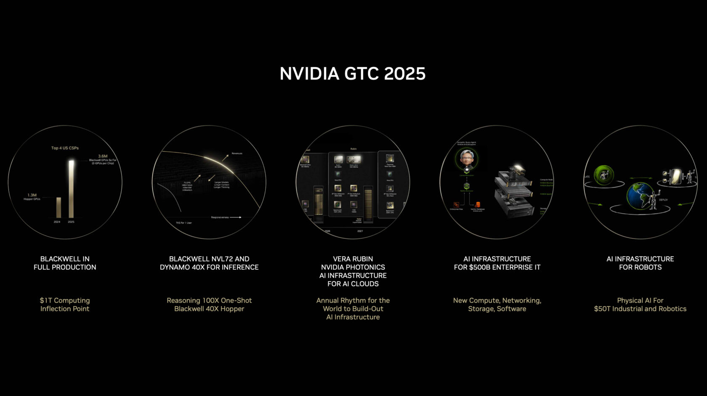

+++
title = 'NVIDIA giới thiệu siêu máy tính kết hợp với máy tính lượng tử tại GTC 2025.'
date = '2025-10-29T14:50:31+07:00'
draft = false
tags = []
categories = []
+++

Tại hội nghị **GTC 2025**, CEO **Jensen Huang** công bố loạt bước tiến mang tính nền tảng trong lĩnh vực **siêu máy tính AI và điện toán lượng tử**, đánh dấu bước ngoặt mới trong chiến lược mở rộng của Nvidia.

---

## Bước tiến lịch sử trong điện toán lượng tử

Sau hơn 40 năm kể từ khi nhà vật lý **Richard Feynman** đề xuất khái niệm máy tính lượng tử, ngành công nghệ đã đạt được bước đột phá: **tạo ra được một qubit logic ổn định và có khả năng sửa lỗi**.  

Tuy nhiên, để vận hành, mỗi qubit logic đòi hỏi **hàng chục đến hàng trăm qubit vật lý** làm nhiệm vụ hỗ trợ và hiệu chỉnh — điều khiến quá trình xử lý trở nên cực kỳ phức tạp.  

Để giải quyết thách thức này, **Nvidia giới thiệu NVQ Link** — kiến trúc kết nối tốc độ cao cho phép **liên kết trực tiếp bộ xử lý lượng tử (QPU)** với **GPU siêu máy tính** của hãng.  

Công nghệ này cùng nền tảng **CUDA Q** cho phép:  
- Thực hiện **sửa lỗi lượng tử thời gian thực**,  
- **Mô phỏng lai (hybrid simulation)** giữa GPU và QPU,  
- Và mở đường cho các **siêu máy tính lượng tử–AI hợp nhất** trong tương lai.  

Theo Jensen Huang, NVQ Link có thể truyền **hàng terabyte dữ liệu mỗi giây** giữa GPU và QPU, giúp các nhà khoa học điều khiển, huấn luyện và tối ưu thuật toán lượng tử bằng AI.  

Nvidia hiện hợp tác với **17 công ty lượng tử hàng đầu** và **8 phòng thí nghiệm năng lượng Hoa Kỳ (DOE)**, bao gồm Berkeley, Brookhaven, Los Alamos và Oak Ridge, để triển khai nền tảng này.

---

## Hợp tác với Bộ Năng lượng Mỹ: 7 siêu máy tính AI mới

Jensen Huang cũng thông báo **quan hệ đối tác giữa Nvidia và Bộ Năng lượng Hoa Kỳ (DOE)** nhằm xây dựng **bảy siêu máy tính AI mới**, phục vụ nghiên cứu khoa học quốc gia.  

Các hệ thống này sẽ khai thác sức mạnh của:  
- **GPU tăng tốc**,  
- **AI mô phỏng vật lý**,  
- **Điện toán lượng tử**,  
- Và **robot tự động hóa thí nghiệm**.  

Mục tiêu là giúp Hoa Kỳ duy trì vị thế **dẫn đầu về khoa học và công nghệ toàn cầu**.

---

## Tái định nghĩa nền tảng điện toán AI

Ở phần cuối bài phát biểu, Jensen Huang nhấn mạnh rằng **AI không chỉ là chatbot**.  
Theo ông, trí tuệ nhân tạo đang **tái cấu trúc toàn bộ “ngăn xếp” điện toán** – từ phần cứng, phần mềm đến mô hình học máy.  

Khái niệm **“tokenization”** (mã hoá mọi dạng dữ liệu – từ ngôn ngữ, hình ảnh, cấu trúc 3D, đến protein và gen) cho phép AI **học và mô phỏng thế giới thực** ở quy mô chưa từng có.  

Huang cũng ghi nhận **chính sách năng lượng thuận lợi của chính quyền Mỹ** là yếu tố quan trọng giúp hạ tầng AI phát triển, vì các trung tâm dữ liệu GPU tiêu thụ lượng điện khổng lồ.

---

## Tầm nhìn tương lai

Theo Huang, tương lai của khoa học là sự **hội tụ giữa điện toán tăng tốc, AI và lượng tử**.  
Những công nghệ này không loại trừ nhau mà sẽ **hợp nhất thành nền tảng siêu máy tính thế hệ mới**, nơi GPU, QPU và AI cùng làm việc để khám phá tự nhiên, thiết kế vật liệu và phát minh thuốc mới.  
