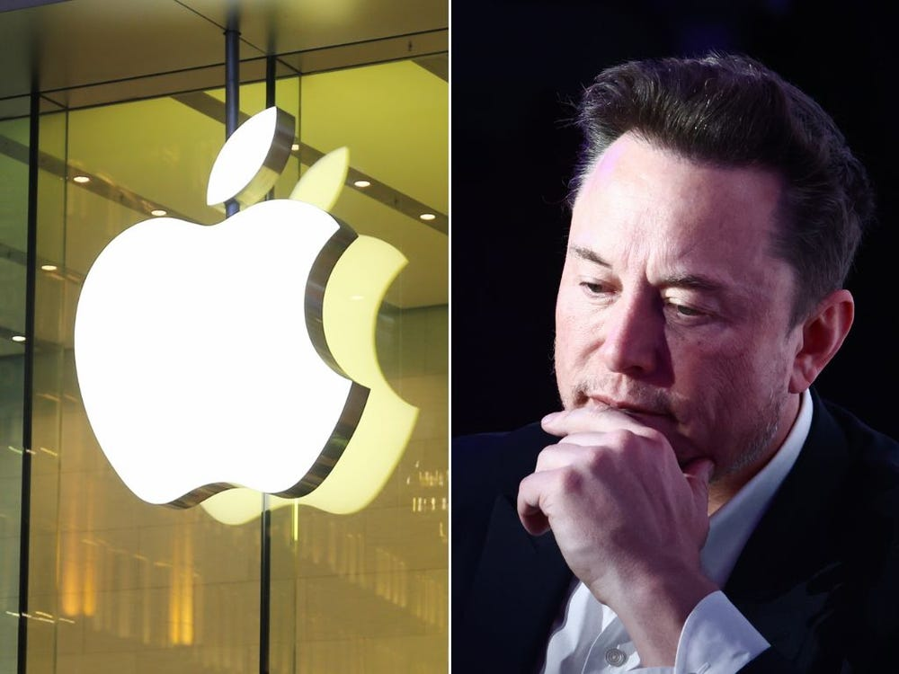

+++
date = '2025-10-27T16:11:24+07:00'
draft = false
title = 'Apple đàm phán với SpaceX để tích hợp Starlink vào iPhone 18 Pro'
+++

Apple được cho là đang đàm phán với SpaceX của Elon Musk để tích hợp kết nối vệ tinh Starlink vào iPhone 18 Pro bắt đầu từ năm 2026, mở rộng ra ngoài SOS khẩn cấp dựa trên Globalstar hiện tại để cho phép nhắn tin và dữ liệu cơ bản ở những khu vực không có vùng phủ sóng di động.

Các cuộc thảo luận sơ bộ, lần đầu tiên được báo cáo bởi The Information vào ngày 23 tháng 10 năm 2025, liên quan đến T-Mobile về khả năng tương thích phổ tần, mặc dù không công ty nào xác nhận chi tiết.

Quan hệ đối tác tiềm năng này nhằm mục đích cung cấp khả năng truy cập giống như 5G liền mạch thông qua các vệ tinh quỹ đạo Trái đất thấp, giải quyết các lỗ hổng kết nối trong bối cảnh cạnh tranh từ các đối thủ như AST SpaceMobile.

Starlink, dự án vệ tinh của Elon Musk qua SpaceX, đang cách mạng hóa internet toàn cầu. Với hơn 8.700 vệ tinh quỹ đạo thấp (LEO), nó chiếm 65% vệ tinh hoạt động thế giới, mang kết nối tốc độ cao (lên đến 500 Mbps), độ trễ thấp đến vùng sâu, nông thôn, biển khơi và thậm chí hàng không. Đến tháng 10/2025, Starlink phục vụ hơn 7 triệu người dùng tại 150 quốc gia, doanh thu 10 tỷ USD/năm, vượt trội đối thủ nhờ chi phí thấp và mở rộng nhanh.

Trước đây, mối quan hệ giữa Apple và Starlink chủ yếu là gián tiếp và căng thẳng. Năm 2015, Apple theo đuổi dự án vệ tinh riêng với Boeing nhưng lo ngại xung đột với nhà mạng, dẫn đến thu hẹp kế hoạch. Năm 2022, trước khi ra mắt Emergency SOS với Globalstar, Elon Musk đề nghị Apple độc quyền Starlink 18 tháng với 5 tỷ USD, nhưng bị từ chối sau 72 giờ. Apple ưu tiên đối tác truyền thống, tránh phụ thuộc SpaceX.