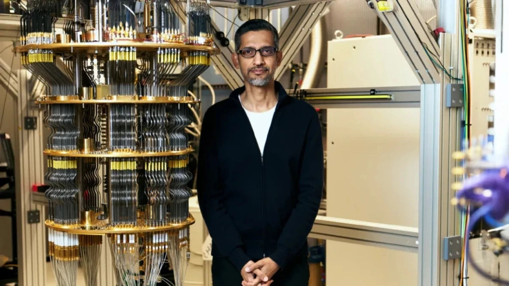

+++
title = 'Đột phá của Google giúp máy tính lượng tử Willow nhanh hơn siêu máy tính 13.000 lần'
date = '2025-10-28T14:17:29+07:00'
draft = false
tags = []
categories = []
+++

Trong một bước tiến quan trọng, Google vừa công bố bộ xử lý lượng tử Willow mang đến sức mạnh vô cùng ấn tượng khi so sánh với các siêu máy tính trong quá khứ.

Kết hợp với Willow, Google đã trình diễn thuật toán mới mang tên Quantum Echoes, được cho là nhanh hơn 13.000 lần so với bất kỳ siêu máy tính cổ điển nào, đồng thời cho phép tái tạo và xác minh kết quả. 
 Thí nghiệm này được thực hiện với sự hợp tác của các nhà nghiên cứu tại UC Berkeley (Mỹ), trong đó nhóm đã sử dụng Quantum Echoes để phân tích hai phân tử: một phân tử gồm 15 nguyên tử và một phân tử gồm 28 nguyên tử. Kết quả thu được không chỉ phù hợp với các phương pháp cộng hưởng từ hạt nhân (NMR) truyền thống mà còn tiết lộ những chi tiết cấu trúc mới mà trước đây không thể quan sát được.

Google gọi phương pháp này là “thước đo phân tử”, cho phép đo khoảng cách và thông tin cấu trúc mà các công cụ tiêu chuẩn không thể tiếp cận. Theo nhóm nghiên cứu, Quantum Echoes có khả năng tính toán động lực học của các hệ thống lượng tử với độ chính xác chưa từng có. Thuật toán này sử dụng kỹ thuật tương tự như “lắng nghe tiếng vọng” trong hệ thống lượng tử, nơi một tín hiệu được gửi vào mạng lưới qubit và quá trình tiến hóa của hệ thống được đảo ngược để phát hiện tiếng vọng phản hồi.

Đáng chú ý, Google đã xây dựng thuật toán này dựa trên một chuẩn mực trước đó có tên là Random Circuit Sampling, nhưng đã cải tiến bằng cách kết hợp khả năng xác minh, cho phép tái tạo kết quả trên các máy tính lượng tử khác có chất lượng tương tự.

Thành tựu này cũng dựa trên chip lượng tử Willow mà công ty công bố vào cuối năm 2024, đại diện cho bước tiến vượt bậc trong việc giảm thiểu lỗi, vốn là một trong những thách thức lớn nhất của điện toán lượng tử. Thiết kế của Willow cho phép thực hiện các thao tác tốc độ cao với tỷ lệ lỗi cực thấp, điều kiện tiên quyết để chạy các thuật toán phức tạp.

Với khả năng xác minh lượng tử cho các trường hợp sử dụng thực tế, Google đã vượt qua một trong những rào cản cuối cùng, chứng minh rằng máy tính lượng tử có thể mang lại những kết quả khoa học có thể tái tạo. 

