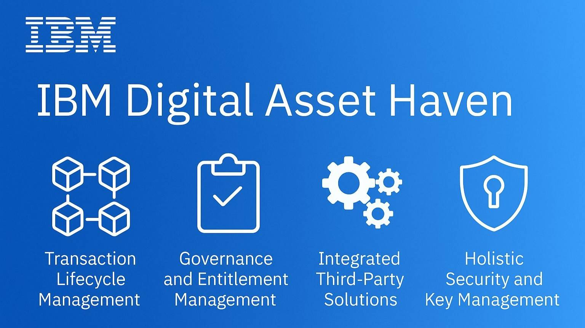

+++
title = ' IBM ra mắt nền tảng Crypto cho chính phủ Hoa Kỳ và các tổ chức tài chính'
date = '2025-10-28T15:13:17+07:00'
draft = false
tags = []
categories = []
+++

Theo Bloomberg, tập đoàn công nghệ toàn cầu IBM vừa chính thức ra mắt Digital Asset Haven - nền tảng tài sản số được thiết kế cho các ngân hàng, tổ chức tài chính, doanh nghiệp và chính phủ, cho phép họ xây dựng và quản lý dịch vụ blockchain an toàn, tuân thủ quy định.

Nền tảng này được phát triển cùng Dfns – công ty Pháp chuyên về hạ tầng ví điện tử, hỗ trợ kết nối hơn 40 blockchain công khai và riêng tư, đồng thời cung cấp dịch vụ lưu ký, thanh toán và xử lý giao dịch tài sản số.

Digital Asset Haven được IBM kỳ vọng sẽ trở thành xương sống công nghệ cho thế hệ tài chính mới, khi các tổ chức truyền thống đang ngày càng quan tâm đến token hóa tài sản (RWA) và stablecoin.
IBM khẳng định nền tảng mới sẽ mang lại dịch vụ lưu ký và thanh toán tiền mã hoá cho các doanh nghiệp và tổ chức chính phủ Mỹ. Mục tiêu chính là đơn giản hoá việc tích hợp tài sản kỹ thuật số vào hệ thống tài chính truyền thống — điều mà nhiều ngân hàng và tập đoàn lớn đang tìm kiếm trong bối cảnh xu hướng token hóa (tokenization) và stablecoin bùng nổ.

Một điểm nổi bật của Digital Asset Haven là khả năng kết nối trực tiếp với hơn 40 mạng blockchain công khai, giúp các tổ chức truy cập lợi nhuận (onchain yield) từ các giao thức tài chính phi tập trung (DeFi) một cách an toàn và hợp pháp.

Bên cạnh đó, nền tảng còn được thiết kế để đáp ứng các yêu cầu tuân thủ phức tạp về token, bao gồm quản trị, xác thực danh tính, và phòng chống rửa tiền (AML) — tất cả được hợp nhất trong cùng một hệ sinh thái do IBM quản lý.

Theo IBM, sự tăng trưởng nhanh chóng của stablecoin và tài sản thực được token hóa (RWA) đang thúc đẩy nhu cầu mạnh mẽ đối với các giải pháp hạ tầng blockchain ở cấp tổ chức. Các ngân hàng, quỹ đầu tư và tổ chức tài chính lớn đang chuyển dần từ “thử nghiệm” sang “triển khai thực tế” khi nhận thấy tiềm năng tiết kiệm chi phí và tăng tốc độ xử lý giao dịch.

Clarisse Hagège, Giám đốc điều hành của Dfns, chia sẻ: “Để tài sản số có thể được tích hợp vào các hệ thống ngân hàng và thị trường vốn, hạ tầng nền tảng phải đạt tiêu chuẩn tương đương với hệ thống tài chính truyền thống. Cùng với IBM, chúng tôi đã xây dựng một nền tảng không chỉ dừng lại ở việc lưu ký mà còn điều phối toàn bộ hệ sinh thái tài sản kỹ thuật số, mở đường cho việc mở rộng quy mô toàn cầu.”

Thị trường tài sản token hóa tăng trưởng bùng nổ

Theo dữ liệu mới nhất của Binance Research, số lượng cổ phiếu token hóa đã tăng hơn 220% chỉ trong tháng 7/2025, mô phỏng lại giai đoạn bùng nổ DeFi 2020–2021, khi tổng giá trị khóa (TVL) tăng từ 1 tỷ lên 100 tỷ USD chỉ trong hai năm.

Cũng trong tháng 7, số lượng ví blockchain nắm giữ cổ phiếu token hóa tăng từ 1.600 lên hơn 90.000 địa chỉ, cho thấy nhu cầu đầu tư vào chứng khoán kỹ thuật số đang tăng mạnh.

Tại hội nghị RWA Summit 2025 ở Cannes, Sergey Nazarov, đồng sáng lập Chainlink, nhận định rằng các công cụ tuân thủ dựa trên blockchain có thể giúp giao dịch truyền thống trở nên “nhanh gấp 10 lần và rẻ hơn đáng kể” so với hệ thống tài chính cũ.

Ngày 30/6 vừa qua, Chainlink cũng đã công bố Automated Compliance Engine (ACE) — một khung tiêu chuẩn mô-đun cho phép các tổ chức quản lý tuân thủ pháp lý trên blockchain, hướng tới việc mở khoá hơn 100 nghìn tỷ USD vốn mới cho nền kinh tế tài sản kỹ thuật số.