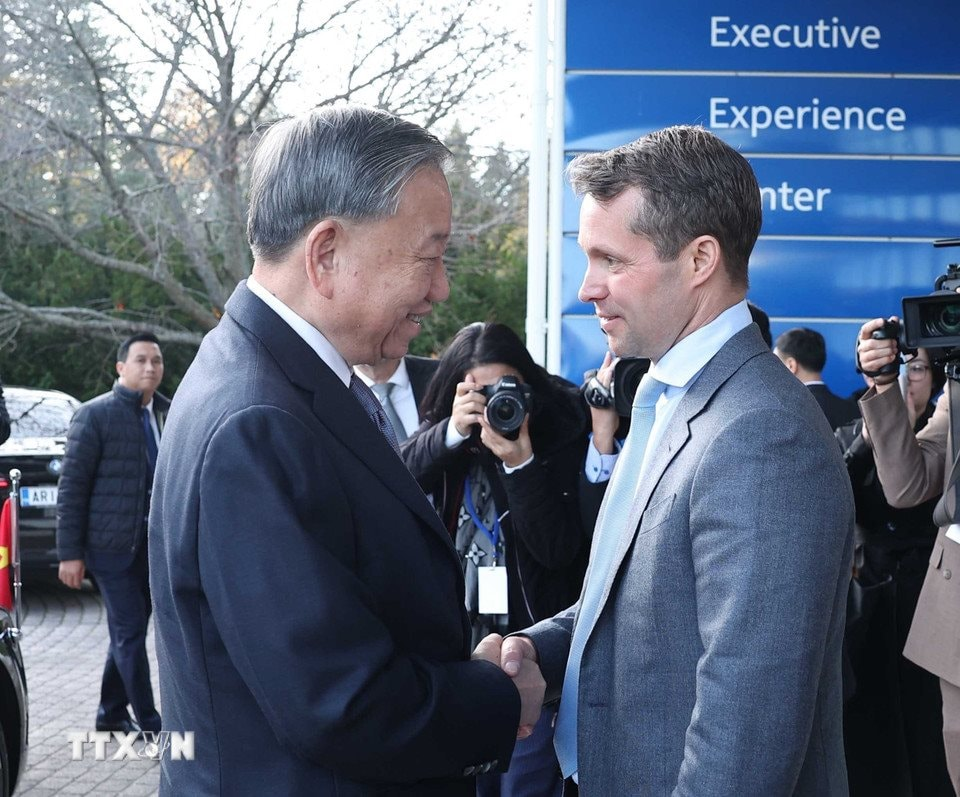

+++
title = 'NOKIA vừa ký hợp đồng hạ tầng mới với VNPT, vừa vận hành cứ điểm sản xuất AirScale toàn cầu'
date = '2025-10-28T13:38:07+07:00'
draft = false
tags = []
categories = []
+++

Tập đoàn công nghệ Nokia (Phần Lan) vừa thông báo mở rộng hợp tác chiến lược với VNPT, tập trung vào việc nâng cấp hạ tầng mạng vô tuyến của nhà mạng này tại nhiều khu vực trọng điểm ở Việt Nam.
 Đây được xem là một bước tiến quan trọng trong việc thúc đẩy kết nối kỹ thuật số của quốc gia, khi VNPT là một trong những nhà khai thác viễn thông hàng đầu Việt Nam.

Theo nội dung thỏa thuận, Nokia sẽ triển khai các thiết bị từ danh mục AirScale, vốn là dòng sản phẩm hàng đầu của hãng công nghệ Phần Lan. Các thiết bị này được hỗ trợ bởi công nghệ chip xử lý (SoC) ReefShark, được biết đến với khả năng tiết kiệm năng lượng, hứa hẹn mang lại kết nối cao cấp, độ trễ thấp và tăng cường dung lượng mạng, đồng thời tối ưu hóa việc tiêu thụ điện năng.

Ngoài việc cung cấp thiết bị, phạm vi thỏa thuận cũng bao gồm các dịch vụ quản lý mạng toàn diện nhằm đảm bảo hiệu suất và độ tin cậy của hệ thống luôn ở mức tối ưu
 Động thái này được kỳ vọng sẽ tạo ra một bước cải thiện đáng kể về chất lượng phủ sóng di động, đặc biệt tại các khu vực biên giới và các trung tâm kinh tế - xã hội trọng điểm. Việc nâng cấp hạ tầng sẽ cho phép người dân và doanh nghiệp tại nhiều tỉnh thành tiếp cận dịch vụ viễn thông và chuyển đổi số một cách hiệu quả hơn, trực tiếp hỗ trợ các mục tiêu rộng lớn hơn của Việt Nam về tăng trưởng kinh tế và bao trùm kỹ thuật số.

Về phía Nokia, hợp đồng này tái khẳng định cam kết mạnh mẽ của hãng tại thị trường Việt Nam. Đáng chú ý, vào năm 2024, Nokia đã quyết định chọn Việt Nam làm trung tâm sản xuất thiết bị AirScale. Trung tâm này hiện đang cung cấp sản phẩm cho cả thị trường nội địa và quốc tế, góp phần củng cố chuỗi cung ứng khu vực và tạo ra các cơ hội kinh tế mới.

Chia sẻ về hợp tác, ông Huỳnh Quang Liêm, Tổng Giám đốc VNPT, cho biết: "Việc mở rộng quan hệ đối tác với Nokia là một bước quan trọng trong việc tăng cường cơ sở hạ tầng viễn thông và kỹ thuật số của Việt Nam, tái khẳng định cam kết của chúng tôi trong việc đáp ứng nhu cầu kết nối và dịch vụ kỹ thuật số ngày càng tăng của người dân, doanh nghiệp và chính phủ. Với công nghệ tiên tiến của Nokia, chúng tôi đặt mục tiêu cung cấp các dịch vụ đẳng cấp thế giới và hỗ trợ các mục tiêu chuyển đổi số của Việt Nam."

Đại diện Nokia, ông Hiro Miura, Giám đốc Khối thị trường Đông Nam Á, cũng nhấn mạnh: "Chúng tôi tự hào khi làm sâu sắc thêm quan hệ đối tác với VNPT và đóng góp vào tương lai kỹ thuật số của Việt Nam. Công nghệ tiên tiến của chúng tôi mang lại hiệu suất vượt trội, cho phép VNPT cung cấp kết nối nhanh hơn, đáng tin cậy hơn, đặc biệt là ở các khu vực biên giới trọng điểm và các trung tâm kinh tế - xã hội lớn. Việc mở rộng này sẽ giúp người dân và doanh nghiệp tiếp cận tốt hơn với các dịch vụ kỹ thuật số thiết yếu, thúc đẩy tăng trưởng kinh tế và nâng cao chất lượng cuộc sống." 
Được biết, thỏa thuận giữa VNPT và Nokia được công bố là một phần trong Lễ trao các văn kiện hợp tác giữa doanh nghiệp hai nước, diễn ra tại Helsinki (Phần Lan) vào chiều 21/10 (giờ địa phương). Sự kiện này diễn ra trong khuôn khổ chuyến thăm chính thức Phần Lan của Tổng Bí thư Tô Lâm, dưới sự chứng kiến của lãnh đạo cấp cao hai nước.

Cũng tại sự kiện này, Nokia còn ký một Bản ghi nhớ chiến lược khác với Tập đoàn Công nghiệp - Viễn thông Quân đội (Viettel). Thỏa thuận với Viettel tập trung vào hợp tác chuyển đổi số, phát triển hạ tầng viễn thông thế hệ mới (5G/6G, Open RAN, AI, Data Center). Việc ký kết đồng thời với cả hai nhà mạng lớn nhất Việt Nam khẳng định mạnh mẽ chiến lược thâm nhập sâu rộng của gã khổng lồ Phần Lan vào thị trường hạ tầng số tại Việt Nam. 
Sự hợp tác sâu rộng này cũng cho thấy chiến lược tập trung của Nokia trong kỷ nguyên mới. Với phần lớn người tiêu dùng Việt Nam, Nokia từng là một "tượng đài" thống trị thị trường điện thoại di động với những sản phẩm siêu bền bỉ. Tuy nhiên, sau cuộc tái cấu trúc mang tính bước ngoặt và bán mảng thiết bị di động cho Microsoft vào năm 2014, Nokia đã hoàn toàn "lột xác".

Nokia của hiện tại là một tập đoàn công nghệ B2B (doanh nghiệp-với-doanh nghiệp) thuần túy, tập trung vào thiết bị viễn thông, mạng lõi 5G, công nghệ đám mây và cạnh tranh trực tiếp với các gã khổng lồ khác như Ericsson hay Huawei để giành thị phần cung cấp hạ tầng cho các nhà mạng toàn cầu. Thương hiệu điện thoại Nokia vẫn xuất hiện trên thị trường tiêu dùng hiện nay là do công ty HMD Global (Phần Lan) khai thác dưới hình thức cấp phép. 