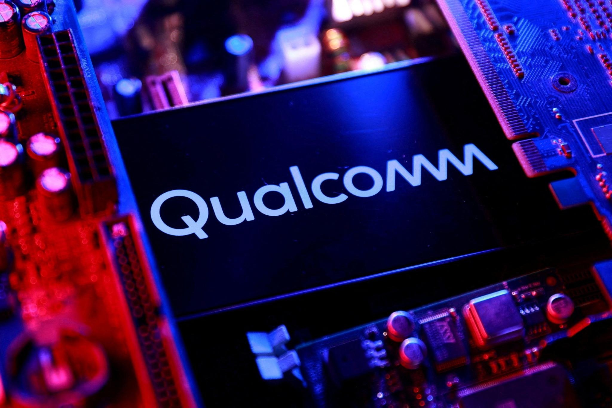

+++
title = 'Qualcomm tham gia thị trường AI trung tâm dữ liệu với 2 chip mới, cổ phiếu tăng hơn 11%'
date = '2025-10-28T13:29:19+07:00'
draft = false
tags = []
categories = []
+++

Qualcomm vừa công bố hai con chip AI hoàn toàn mới, mang tên AI200 và AI250, đánh dấu bước ngoặt lớn trong chiến lược mở rộng từ mảng di động sang thị trường trung tâm dữ liệu AI. Đây được xem là động thái mạnh mẽ nhất của hãng trong nỗ lực cạnh tranh với Nvidia và AMD.

Tập trung vào hiệu năng và tiết kiệm năng lượng

Theo thông tin từ Qualcomm, bộ đôi AI200 và AI250 được thiết kế cho nhiệm vụ AI inference, tức là giai đoạn vận hành các mô hình trí tuệ nhân tạo đã được huấn luyện sẵn. Mục tiêu của Qualcomm là tạo ra nền tảng AI có chi phí hợp lý và tiết kiệm điện năng hơn so với những giải pháp hiện nay.

Dòng AI200 dự kiến sẽ được thương mại hóa trong năm 2026, còn AI250 sẽ ra mắt vào 2027. Qualcomm cho biết AI250 được trang bị kiến trúc “near-memory computing”, giúp tăng hiệu quả xử lý dữ liệu và băng thông bộ nhớ lên đến 10 lần so với thế hệ trước.

Mỗi thẻ tăng tốc AI có thể tích hợp tối đa 768 GB bộ nhớ LPDDR, và được hỗ trợ đầy đủ các nền tảng phát triển phổ biến như PyTorch, ONNX và LangChain, giúp các nhà phát triển dễ dàng triển khai mô hình trên hệ thống mới của Qualcomm.

Bên cạnh việc ra mắt chip mới, Qualcomm còn ký thỏa thuận hợp tác với Humain (Ả Rập Saudi) để triển khai hạ tầng AI có công suất 200 MW, sử dụng dòng AI200 bắt đầu từ năm 2026. Thông tin này đã khiến cổ phiếu Qualcomm tăng hơn 11%, cho thấy thị trường kỳ vọng cao vào chiến lược mở rộng sang lĩnh vực trung tâm dữ liệu.

Cạnh tranh trực tiếp với Nvidia và AMD

Hiện tại, Nvidia vẫn đang dẫn đầu trong mảng AI trung tâm dữ liệu với các dòng GPU H100 và B200, trong khi AMD cũng đang đẩy mạnh với dòng MI325X. Qualcomm muốn mang đến lựa chọn mới cho doanh nghiệp với hướng tiếp cận hiệu quả năng lượng, giúp giảm chi phí vận hành trong bối cảnh nhu cầu xử lý AI ngày càng lớn.

Các chuyên gia nhận định rằng Qualcomm có lợi thế về kinh nghiệm thiết kế chip di động, nhưng việc bước vào sân chơi trung tâm dữ liệu sẽ là thử thách thực sự, bởi ngoài phần cứng, hãng còn phải xây dựng hệ sinh thái phần mềm và dịch vụ cho doanh nghiệp. Dù vậy, AI200 và AI250 vẫn được xem là bước tiến lớn giúp Qualcomm trở lại mạnh mẽ hơn trong kỷ nguyên AI.