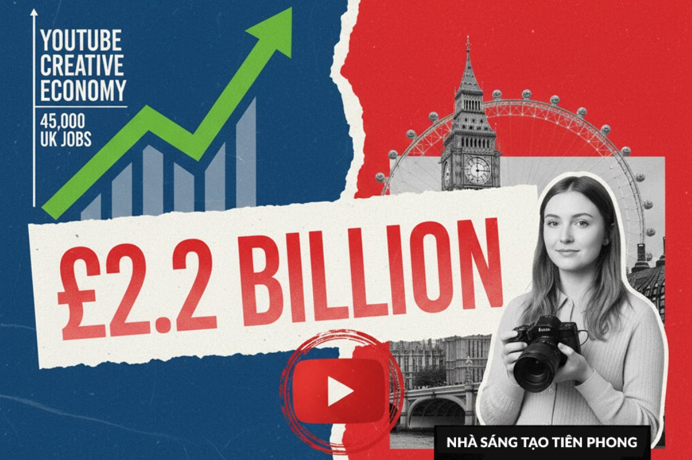

+++
title = 'YouTube Đóng Góp 2,2 Tỷ Bảng Anh Cho Vương Quốc Anh'
date = '2025-10-28T10:27:02+07:00'
draft = true
tags = []
categories = []
+++

Lĩnh vực sáng tạo nội dung trên YouTube tại Vương quốc Anh đã chính thức khẳng định vai trò là một động lực kinh tế lớn. Theo báo cáo tác động do Oxford Economics thực hiện, các nhà sáng tạo nội dung YouTube đã đóng góp 2,2 tỷ bảng Anh cho nền kinh tế Vương quốc Anh và hỗ trợ 45.000 việc làm chỉ riêng trong năm 2024.

Sự công nhận này diễn ra đồng thời với việc ra mắt một Nhóm Nghị sĩ Liên Đảng (APPGs) chuyên đại diện cho các nhà sáng tạo và người ảnh hưởng tại Anh.

Từ Người Tiên Phong Đến Chính Trường

Bà Feryal Clark, Nghị sĩ Đảng Lao động và đồng chủ tịch APPG mới thành lập, mô tả những nhà sáng tạo này là "những người tiên phong của một cuộc cách mạng sáng tạo mới" và đã bị "đánh giá thấp ở Westminster quá lâu".
Đối với nhiều nhà sáng tạo, việc thành lập nhóm nghị sĩ này là biểu tượng của sự công nhận từ chính phủ. Họ tin rằng, với khoảng 500 APPG đại diện cho nhiều ngành nghề khác nhau, nhóm này sẽ có khả năng cung cấp những hiểu biết sâu sắc trực tiếp đến các nhà hoạch định chính sách, giúp tháo gỡ các rào cản đang kìm hãm sự phát triển.

Nhà sáng tạo nội dung nổi tiếng người Anh, Lilly Sabri, bày tỏ sự hoan nghênh:

"Trong nhiều năm, mọi người đã nghi ngờ liệu làm nhà sáng tạo nội dung có phải là một công việc thực sự hay không, và liệu bạn có thể xây dựng một sự nghiệp bền vững từ nó. Nếu không có YouTube, tôi đã không thể đạt được vị thế như hôm nay và không thể ra mắt những doanh nghiệp này hay tạo được nhiều việc làm như hiện tại."​

Thách Thức và Lời Kêu Gọi Hỗ Trợ

Mặc dù Vương quốc Anh là quê hương của nhiều YouTuber hàng đầu thế giới như DanTDM hay nhóm Sidemen (với hàng triệu người đăng ký), các nhà sáng tạo vẫn đối mặt với nhiều khó khăn. Các thách thức chính bao gồm: tiếp cận đào tạo và cơ hội tài trợ, tìm kiếm không gian studio phù hợp, và việc xin giấy phép quay phim phức tạp.
Brandon B, nhà sáng tạo với 16 triệu người đăng ký, nổi tiếng với các video hiệu ứng hình ảnh ngắn, nhấn mạnh ngành công nghiệp này cần sự hỗ trợ của chính phủ để “đột phá lên một cấp độ mới”

"Chúng tôi phát triển có quy mô và bây giờ chúng tôi thực sự cần sự chấp thuận của chính phủ và một tiếng nói trong Quốc hội để giúp chúng tôi vượt qua giai đoạn này. Các vấn đề liên quan việc hỗ trợ tăng trưởng doanh nghiệp, từ việc có thể tiếp cận vốn hoặc khoản vay từ ngân hàng, và đơn giản là có được cơ sở hạ tầng xung quanh."​

Brandon B chia sẻ rằng dù có lượng người theo dõi khổng lồ, anh vẫn gặp khó khăn trong việc điều hướng các quy tắc xin giấy phép quay phim tại Anh do "các hệ thống cồng kềnh".

Khoảng Cách Doanh Thu Quảng Cáo

Joseph Garrett (còn gọi là Stampy, với 10 triệu người đăng ký) chỉ ra một vấn đề cốt lõi về mô hình kinh doanh: các nhà sáng tạo vẫn phụ thuộc nặng nề vào các nguồn doanh thu truyền thống như nhà quảng cáo và nhà tài trợ. Ông nói: "Điều này đã tạo ra sự chênh lệch đáng kể giữa lượt xem và doanh thu được tạo ra cho nội dung trực tuyến so với truyền thông truyền thống hơn."

Trong lịch sử, YouTuber cần có số lượng người xem video nhiều hơn đáng kể so với truyền hình để nhận được cùng một khoản tiền quảng cáo. Điều này là do các nền tảng phát trực tuyến thường trả tiền dựa trên sự tương tác của người xem với quảng cáo, trong khi quảng cáo trên TV thường được trả theo một mức cố định. Tuy nhiên, Stampy cho biết tình hình này đã bắt đầu thay đổi trong những năm gần đây.

Dấu Hiệu Chính Trị Hóa: Tầm Ảnh Hưởng Đang Lớn Dần

Sự ra đời của APPG không phải là dấu hiệu đầu tiên cho thấy các nhà sáng tạo nội dung đang bước vào dòng chảy chính trị. Mùa hè vừa qua, Thủ tướng Sir Keir Starmer đã mời 90 người ảnh hưởng đến buổi chiêu đãi tại Phố Downing. Tương tự, tại Mỹ, Nhà Trắng đã bắt đầu mở các cuộc họp báo cho cả các nhà sáng tạo nội dung và người ảnh hưởng, đặt họ ngang hàng với các nhà báo truyền thống.

Những động thái này cho thấy các nhà lập pháp trên toàn thế giới đang nhận ra sức mạnh lan tỏa và tác động kinh tế không thể phủ nhận của ngành công nghiệp sáng tạo nội dung. Trong lúc đó, tại sao chúng ta không ủng hộ thông qua lượt tương tác với những nội dung sáng tạo chất lượng?