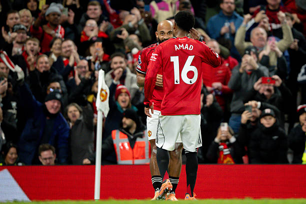

+++
title = 'MU sẽ như thế nào vào tháng 1 khi cúp bóng đá châu phi AFCON khởi tranh'
date = '2025-10-29T09:12:18+07:00'
draft = false
tags = []
categories = []
+++

Man United có vẻ sẽ chứng kiến ​​ba cầu thủ chủ chốt lên đường làm nhiệm vụ quốc tế tại AFCON vào tháng 12 và tháng 1.
Ruben Amorim dường như cuối cùng đã tìm được một đội hình xuất phát ổn định và đang thể hiện tốt. United đã giành chiến thắng 4-2 trước Brighton vào cuối tuần qua, đây là chiến thắng thứ ba liên tiếp của họ tại giải đấu lần đầu tiên dưới thời huấn luyện viên người Bồ Đào Nha.
United hiện đang đứng thứ sáu trên bảng xếp hạng Ngoại hạng Anh, và đội bóng của Amorim dường như đang hòa nhập tốt. Tuy nhiên, vị huấn luyện viên của United sẽ phải lưu ý rằng ba cầu thủ chủ chốt sẽ rời đi vào tháng 12 khi Cúp các quốc gia châu Phi khởi tranh vào Chủ nhật, ngày 21 tháng 12, kéo dài đến Chủ nhật, ngày 18 tháng 1.
Noussair Mazraoui sẽ chơi cho Morocco, Amad Diallo sẽ khoác áo Bờ Biển Ngà, và người hùng trước Brighton, Bryan Mbeumo, sẽ dẫn dắt hàng công Cameroon tại giải đấu. Vì cả ba quốc gia đều nằm trong số những ứng cử viên sáng giá nhất cho giải đấu, United có thể sẽ thiếu vắng bộ ba này trong một thời gian dài, vậy đội hình xuất phát của Amorim sẽ ra sao khi họ vắng mặt?

Hàng phòng ngự của MU vẫn không thay đổi
Thủ môn - Senne Lammens (18,2 triệu bảng). Trung vệ - Leny Yoro, Matthijs De Ligt, Luke Shaw (128,8 triệu bảng).
Đầu tiên, hàng phòng ngự của Amorim vẫn giữ nguyên như những trận đấu trước bất chấp việc Mazraoui sẽ không thể ra sân. Hậu vệ người Morocco này đã chơi cho United ở hàng phòng ngự ba người, nhưng anh đã gặp vấn đề về chấn thương trong mùa giải này và không thể thay thế Yoro và Shaw, những người đã thể hiện rất tốt gần đây.
Cũng cần lưu ý rằng trong khuôn khổ AFCON, Lisandro Martinez có thể trở lại sau chấn thương dây chằng chéo trước, mang đến cho Amorim thêm một lựa chọn ở hàng phòng ngự.

Dorgu thay thế Amad ở vị trí hậu vệ cánh
Tiền vệ cánh - Patrick Dorgu, Diogo Dalot (44 triệu bảng). Tiền vệ trung tâm - Bruno Fernandes, Casemiro (107 triệu bảng)
Ở hàng tiền vệ, Amad Diallo đã chơi ở vị trí wing-back trong những tuần gần đây, còn Diogo Dalot chơi ở cánh còn lại. Amad đã phối hợp tốt với Bryan Mbeumo bên cánh phải, nhưng khi anh ấy ra đi, Patrick Dorgu sẽ lấy lại vị trí trong đội hình xuất phát. Chúng ta cũng có thể thấy tân binh mùa hè Diego Leon sẽ có nhiều cơ hội hơn khi Diallo vắng mặt, bởi hậu vệ cánh người Paraguay này vẫn chưa ra sân cho United mùa này kể từ khi chuyển đến từ Cerro Porteno.

Mason Mount sẽ thay thế Mbuemo ở vị trí tấn công
Tiền vệ cánh - Mason Mount, Matheus Cunha (122,5 triệu bảng). Tiền vệ cánh - Benjamin Sesko (74 triệu bảng)
Mbeumo đã trở thành cầu thủ chủ chốt của United. Có thể nói đây là bản hợp đồng tốt nhất của họ dưới thời Amorim cho đến nay, nhưng anh ấy sẽ là một thiếu sót lớn trên hàng công. Điểm cộng là Mason Mount đã thể hiện tốt khi được yêu cầu đá chính mùa này, vì vậy Amorim hoàn toàn có thể sẽ xếp tiền vệ người Anh này vào vị trí tiền đạo.
Nếu Mount hoặc Cunha gặp chấn thương, Amorim có thể buộc phải để Bruno Fernandes đá lùi về tấn công, và đá cặp với Kobbie Mainoo hoặc Manuel Ugarte ở vị trí tiền vệ trụ bên cạnh Casemiro. Quỷ đỏ cũng có thể sẽ tìm cách tăng cường chiều sâu hàng tiền vệ trong kỳ chuyển nhượng tháng Giêng.